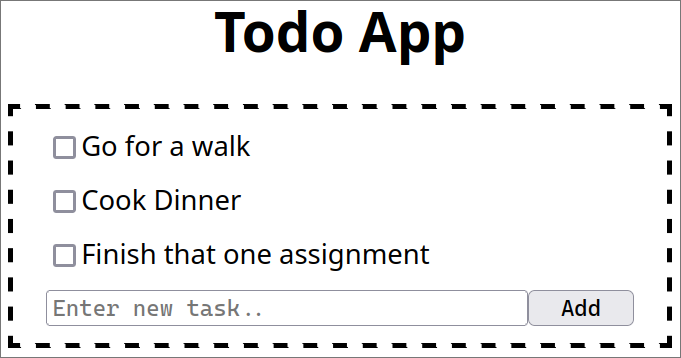

# Todo App
Simple todo app  
Api built with flask & waitress, todos kept in memory  
Website built with vanilla javascript, served by the same flask app  

<div align="center">
    
</div>  

## Building
**Build Dependencies**
 - docker-engine

**Build & Run**
```bash
docker build -t todo-app .
docker run --rm -e PORT=5000 -p 80:5000 todo-app
```
